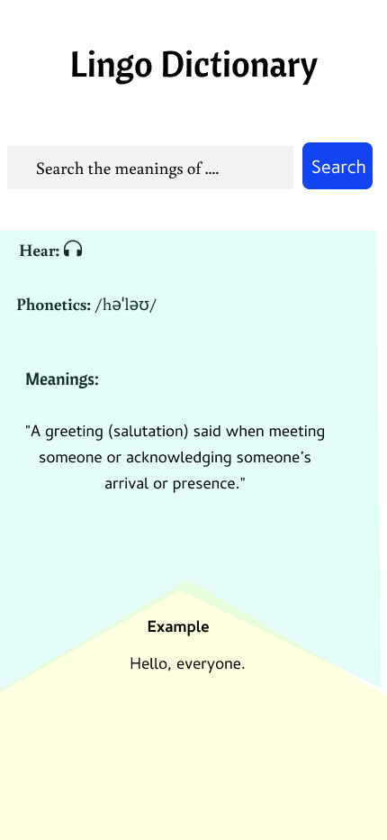
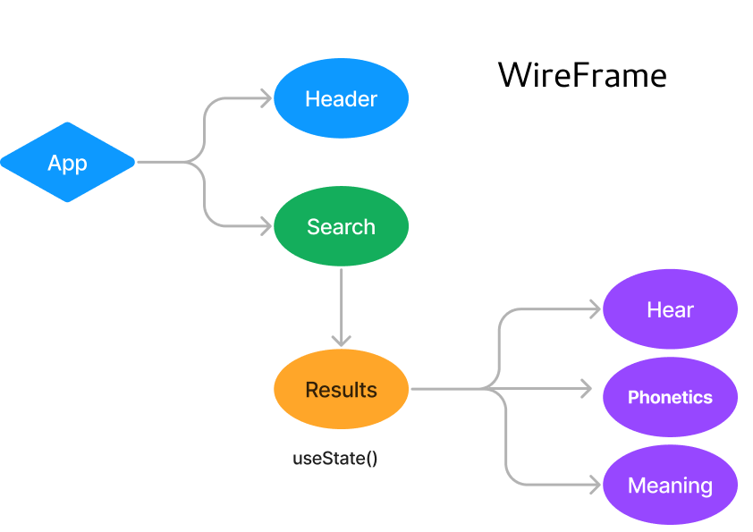

# Lingo Dictionary App

Lingo Dictionary is an App that renders data from an [API](https://dictionaryapi.dev). The phonetics, pronunciation audio, meanings and examples are displayed when a word is searched.
- The prototype and framework of the app has been designed using Figma. 
- The App is created using React.js and React Bootstrap.
- Lingo Dictionary App is deployed on Netlify. The link of deployed app is  https://lingo-dictionary.netlify.app/

  

### How to run the App locally on your Machine
* Fork and Clone the repo
* `cd lingo-app`
* In the project directory, you can run:
 `npm start`
Runs the app in the development mode.
* Open [http://localhost:3000](http://localhost:3000) to view it in your browser.

The page will reload when you make changes.\
You may also see any lint errors in the console.

